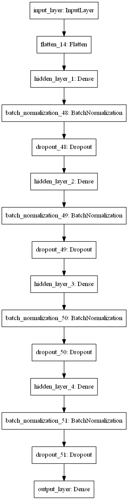
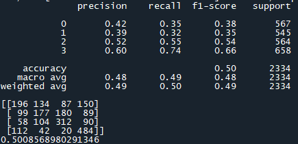
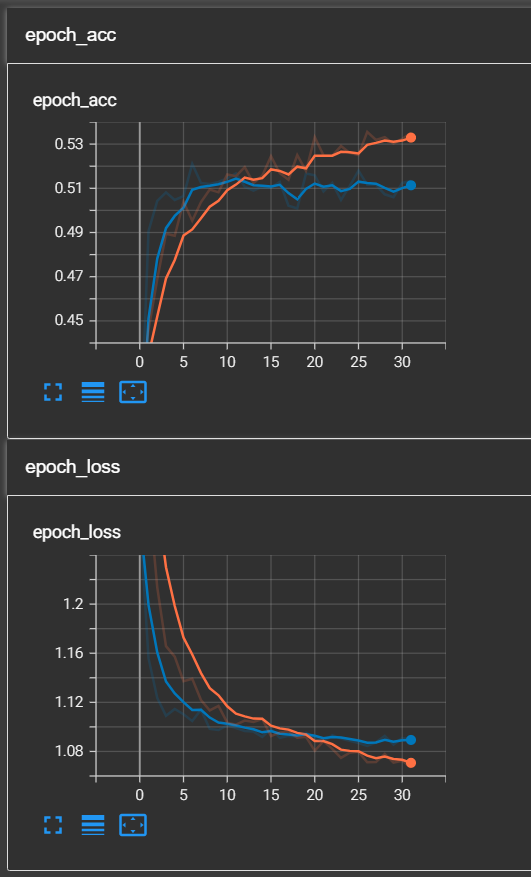

# Customer Segmentation 
 Customer segmentation is the practice of dividing a customer base into groups of individuals that are similar in specific ways relevant to marketing, such as age, gender, interests and spending habits.

# Description 

This repository will contain 3 python files (customer_segmentation_train.py, customer_segmentation_deploy.py and customer_segmentation_modules.py) 

customer_segmentation_train.py contains the codes to train a machine learning model for our dataset (Customer Segmentation)

customer_segmentation_deploy.py contains the codes to deploy and launch our saved model from customer_segmentation_train.py with new test dataset 

customer_segmentation_modules.py contains the classes needed to run customer_segmentation_train.py

__init__.py is just a needed blank script

I also included tensorboard plotting to see the performance of my model even though it was not that great

# How to use 

1. Clone this repository and use the model.h5 (saved model), scaler.pkl, encoder.pkl and ohe.pkl to deploy on your dataset
2. You can also use the customer_segmentation_deploy.py to run predict new dataset
3. Run tensorboard at the end of training to see how well the model perform via conda prompt. Activate the desired environment and proper working directory.
4. Type "tensorboard --logdir "the log path"
5. Paste the local network link into your browser and it will automatically redirected to tensorboard local host and done! Tensorboard is now can be analyzed.

# The architecture of my deep learning model

# Performance of my model

# Tensorboard screenshot from my browser

# Discussion

As per requestion from our question file, we need to obtain more than 80% 
accuracy and F1 score for our deep learning model. Unfortunately, I only 
managed to train up until approximately max 52% accuracy. This is actually
heartbreaking for me because this is the final assessment for this course, 
but I am pretty sure I have done my very best. Therefore, I would like to 
discuss on how to rescue this model and get a better accuracy!

1. As Deep Learning is a data hungry method, we might want to add more data
and run our model on train to get a better accuracy. Even tho we already have 
thousands of data, but I believe, we need more than that in order to get an
even better accuracy with good F1 score.

2. By increasing the number of nodes, layers or even epochs might help by a
little amount, but it is worth a try.

3. I always believe that the key to a flawless model is always starts from
the data cleaning phase. I need to get better at cleaning the data, dealing
with NaN(s), missing values, null(s), using imputer intelligently, encode 
with care and standardize data when needed. I will pledge to myself to learn 
more for data cleaning. In fact, i have spent most of my time cleaning the 
data and do a lot of trial and error to obtain better accuracy and F1 score.
This assignment is a good exercise for me and in my assumption, for all of 
my batchmates as well.

To conclude everything, this is not the best one yet. I could've done better.
In the future, I hope i can do better by continuously learn :)

# Credit

shout out to the owner of our dataset: [https://www.kaggle.com/rashikrahmanpritom/heart-attack-analysis-prediction-dataset](https://www.kaggle.com/datasets/abisheksudarshan/customer-segmentation)
